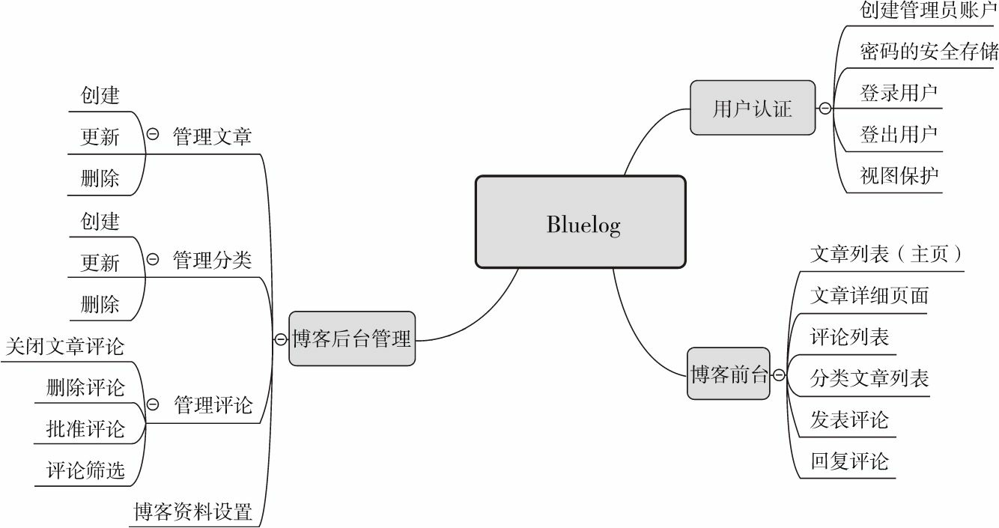

# 个人博客（ flask学习笔记）

## 大型项目结构

1. 蓝本模块化程序
    - 创建蓝本
    - 装配蓝本
    - 注册蓝本
    - 蓝本的路由端点
    - 蓝本资源

2. 使用类组织配置

3. 工厂函数创建程序实例
   1. 加载函数
   2. 初始化扩展
   3. 组织工厂函数
      1. 根据类别分离成多个函数 register_*()
      2. 工厂函数统一注册
   4. 启动程序
      1. flask run 运行 ,自动从环境变量FLASK_ENV 指定的模块中寻找create_app() 或 make_app() 方法并运行
      2. 显示指定工厂函数并传参: Flask_ENV = "bluelog:create_app('development')"
   5. current_app 
      1. 调用蓝本没有的， 应用实例独有的方法和属性
      2. 表示当前程序实例的代理对象

## 编写程序骨架



1. 数据库
   - 创建数据库模型
   - 邻接列表关系
   - 生成虚拟数据（管理员、分类、文章、评论）

2. 模板
   - 模板上下文
   - 渲染导航链接
   - flash 消息分类 
  
3. 表单
   - 登录表单
   - 分类表单
   - 文章表单
   - 评论表单
   - 博客设置表单

4. 视图函数
5. 电子邮件支持

## 编写博客前台

1. 分页显示文章列表
   - 获取分页记录
   - 渲染分页导航部件

2. 显示文章正文
3. 文章固定链接
4. 显示分类文章列表
5. 显示评论列表
6. 发表评论和回复
7. 支持回复评论
8. 网站主题切换

## 初始化博客

1. 安全存储密码
2. 创建管理员用户

## Flask-Login 管理用户认证

1. 获取当前用户 current_user
   1. Flask_Login 提供UserMixin 类，Admin 继承实现 判断用户状态的方法啊和属性
2. 登入用户
   1. current_user.is_authenicated() 判断用户是否登录
   2. login_user(admin, remmember)
   3. url_for()方法， 添加next=request.full_path, 存储当前页面路径，作为登出操作可返回上一级页面
3. 登出用户
   1. logout_user()
4. 视图保护
   1. @login_required 登录才能访问的页面

## 使用CSRFProtect实现CSRF保护
```python
from flask_wtf.csrf import CSRFProject

csrf = CSRFProject() # 在extentions.py 中实例化
csrf.init_app(app)#在构造文件的工厂函数create_app中初始化

# 在模板中提供了 csrf_token()函数

# 令牌验证出错或过期出现400 错误
from flask_wtf.csrf import CSRFError
# 错误信息保存在 description中
@app.errorhandler(CSRFError)
def handle_csrf_error(e):
   return render_template('400.html', description=e.description), 400
```


## 编写博客后台

1. 文章管理
   - 文章管理主页
   - 创建文章
   - 编辑与删除

2. 评论管理
   - 关闭评论
   - 评论审核
   - 评论筛选

3. 分类管理


## 小结

